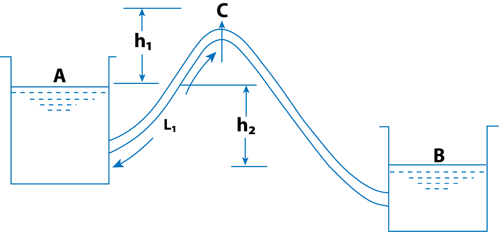

<h2>FLOW THROUGH SYPHON</h2>

Syphon is a long bent pipe which is used to transfer liquid from a reservoir at a higher elevation to another reservoir at a lower level when the two reservoirs are separated by a hill or high level ground as shown in Fig. 1.

$$ Figure\ 1 $$

The point C which is at the highest of the syphon is called the summit. As the point C is above the free surface of the water in the tank A, the pressure at C will be less than atmospheric pressure. Theoretically, the pressure at C may be reduced to - 10.3 m of water but in actual practice this pressure is only – 7.6 m of water or 10.3 -7.6 2.7 m of water absolute. If the pressure at C becomes less than 2.7 m of water absolute, the dissolved air and other gases would come out from water and collect at the summit. The flow of water will be obstructed. Syphon is used in the following cases :
1. To carry water from one reservoir to another reservoir separated by a hill or ridge.
2. To take out the liquid from a tank which is not having any outlet.
3. To empty a channel not provided with any outlet sluice.